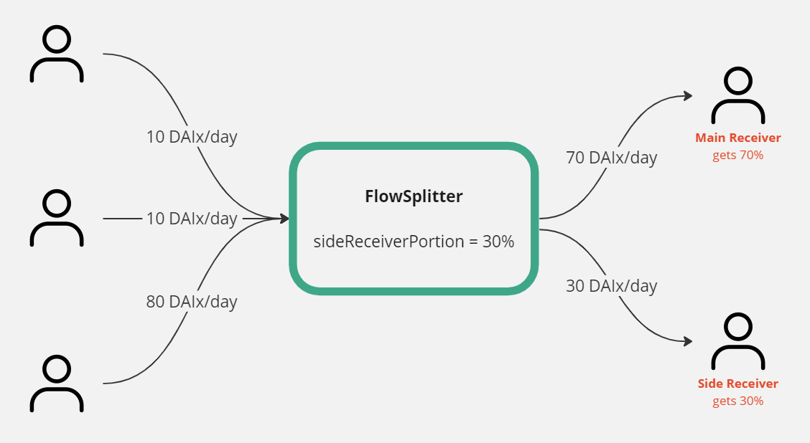

# Flow Splitter Super App

This project demonstrates a Superfluid Super App smart contract that routes incoming streams to two receiver accounts on the basis of a set proportions.

  

  

It also does a great job of demonstrating the usage of the SuperAppBaseCFA.
