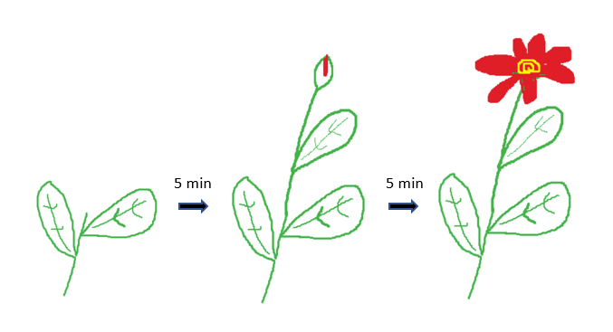

# Water a Growable NFT With Superfluid Streams

The [Flower NFT Contract](./contracts/Flower.sol) is an ERC721 contract that is also a Super App. As the amount of Super Tokens you stream to it crosses certain thresholds, the NFT's metadata will progressively graduate.

## Tutorial

Skip to 14:20 for the bulk of the Flower NFT logic/code walk-through

## Technical Explainer

See the [Flower NFT Contract](./contracts/Flower.sol). It exposes callbacks (the `afterAgreement...` functions) that are triggered in response to the creating/updating/deleting of streams to the Flower NFT contract.

These callbacks help maintain accounting for how much was streamed into the contract (how much the NFT was "watered") upon each stream modification. Also, when you first start a stream to the contract, `afterAgreementCreated` kicks in and mints you a Flower NFT.

The `tokenURI` function is what platforms like OpenSea use to show an NFT's imagery. The Flower NFT's tokenURI function is overriden to return the appropriate image based on how much was streamed into the contract (how much "the Flower was watered").

An address may only hold one Flower NFT at a time.

## Environment Variables
Before interacting with this project's scripts, you'll want to make a .env file following [.env.template](.env.template)

`PRIVATE_KEY` - The private key of a test wallet you want to use for development here. Make sure it has some [Mumbai MATIC](https://faucet.polygon.technology/).

`MUMBAI_URL` - HTTPS endpoint for RPC node you'll be using. You can get one from Alchemy [here](https://auth.alchemy.com/?redirectUrl=https%3A%2F%2Fdashboard.alchemy.com%2F) or Infura [here](https://app.infura.io/register).

`POLYGONSCAN_KEY` - Paste your Polygonscan API Key here. You can get one at https://polygonscan.com/register

## Scripts and Utilities
Make sure you've created an `.env` file and filled out the suggested variables from `.env.template`

**Scripts**

`mintSuperWater` - Funds your wallet with many WATERx tokens

`deployFlower` - deploys Flower NFT contract

`streamWater` - streams WATERx tokens from your wallet into the Flower NFT contract (you're minted a Flower NFT as a result)

`transferAway` - rids your wallet of a Flower NFT you may already possess

**Utilities**

`deployedContracts` - track your deployed contracts so the above scripts are using the right addresses

`deployWater` - deploy a new WATER ERC20 token. You can deploy a wrapper for it with the [Super Token Wrapper Deployer](https://deploy-supertoken-deployment.vercel.app/)

`generateMetadata` - produces properly formatted metadata json files with images in .resources/img/plant-stages.

## Try it out live on Mumbai Testnet

1. Clone the repo and build with `npm install`
2. Create a `.env` file and fill out the suggested variables from `.env.template`
   - Make sure the wallet you're providing a private key for has some Mumbai MATIC in it. This wallet will be receiving the Flower NFT!
3. Mint some WATERx Super Tokens with `npx hardhat run scripts/mintSuperWater.js --network polygon_mumbai`
4. Stream the WATERx Super Tokens to the Flower contract with `npx hardhat run scripts/streamWater.js --network polygon_mumbai`
5. Go to [Opensea's Testnet App](https://testnets.opensea.io/) and search your address.
   - You should see an "Evolving Flower NFT". That's it! You are now watering the NFT. Note down its token ID
6. After 2 minutes, go to [this NFT Viewer](https://www.nftviewer.xyz/), click into the "Smart Contract" page. Then, enter the contract address (`0x015b0C429B9cC32AB8470c3cb3E11AB548cBe996`) and your token ID.

You'll see the NFT image has changed to show a more grown up flower! If you wait another 2 minutes, you'll see it grows again.

  

  